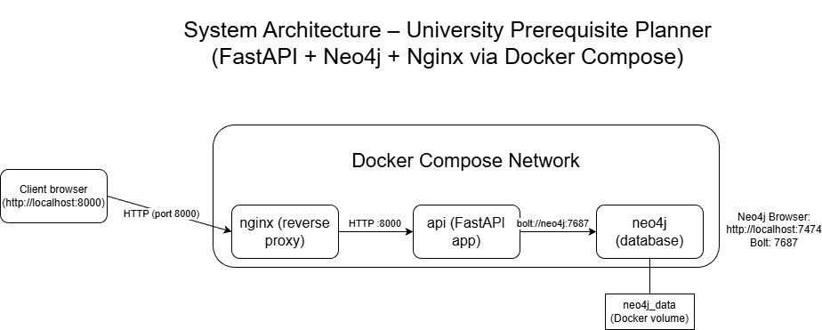
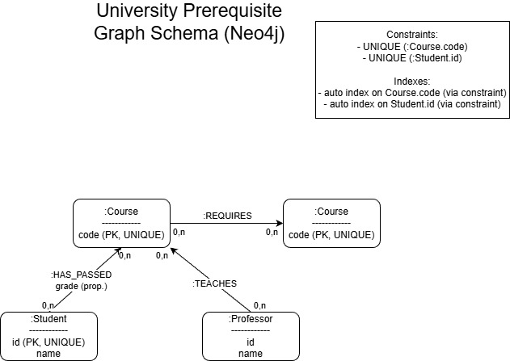
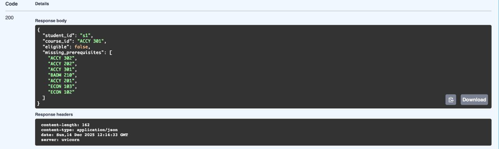
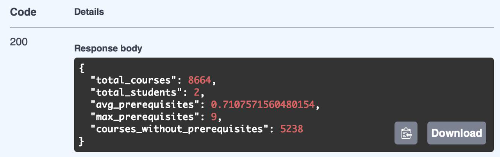
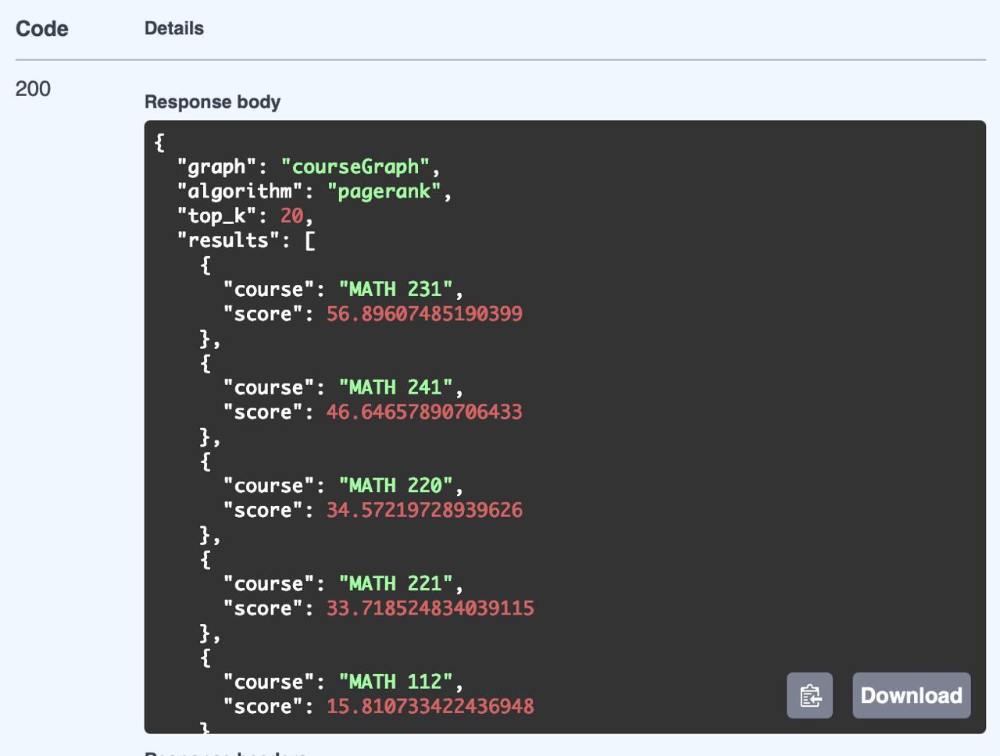
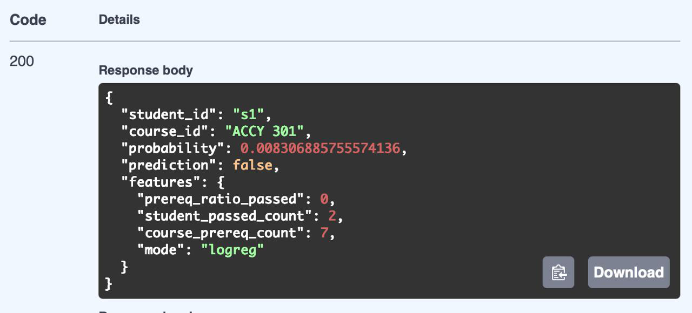
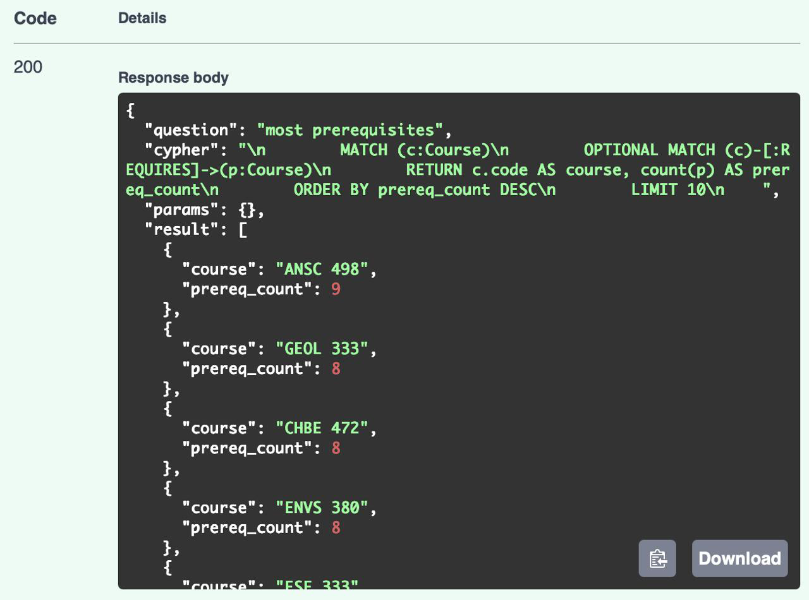
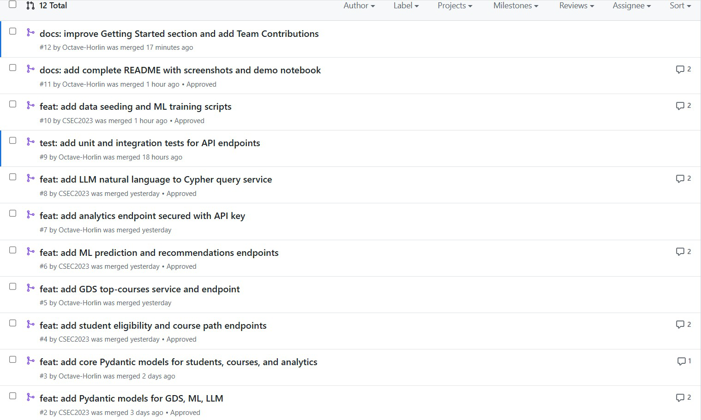

# University Course Prerequisite Planner

A graph-based academic planning system that helps students explore course prerequisites, plan valid learning paths, and receive data-driven recommendations.
The application combines Neo4j, FastAPI, Graph Data Science (GDS), Machine Learning, and an optional LLM (Natural Language → Cypher) interface, all orchestrated with Docker Compose.

## Features
Course prerequisite graph modeled in Neo4j
Student eligibility checking for any target course
Course sequence planning (level-by-level, parallelizable paths)
Cycle detection in prerequisite graphs
Shortest prerequisite paths between courses
Graph analytics (counts, averages, statistics)
Graph Data Science (GDS) algorithms (PageRank, Degree)
Machine Learning predictions (probability a student passes a course)
Natural Language queries translated into Cypher (safe LLM + templates)
API key–secured endpoints
Automated tests & coverage
Fully containerized stack

## Dataset

This project uses the **UIUC Course Prerequisite Dataset**:

- Source: https://github.com/illinois/prerequisites-dataset  
- Description: real-world dataset of course prerequisites from the University of Illinois (8,589 course sections).
- Reason for choice:
  - It naturally fits a graph model (courses + prerequisite relations)
  - It is large enough to produce interesting query patterns and paths
  - It is publicly available and well-documented

## How to run the project

### 1. Clone & setup environment
**git clone https://github.com/CSEC2023/Final_project_graph.git** clones the project
**cd Final_project_graph** navigates to the right folder
**cp .env.example .env** and personnalize the `.env` file with your own values (using a text editor)

### 2. Run the project (from a clean state)
**docker rm -f prereq-api** removes the existing API container to start from a clean state.
**docker rm -f prereq-nginx** removes the existing Nginx container.
**docker rm -f neo4j** removes the existing Neo4j container (volumes/data are preserved).

**make docker-run** rebuilds images if needed and starts Neo4j, FastAPI, and Nginx using Docker Compose.

**docker-compose exec api python scripts/seed_data.py** runs the seeding script to load courses and prerequisites into Neo4j.

## Docker Image

The API Docker image is available on Docker Hub:

**https://hub.docker.com/r/gabrielaidams/prereq-api**

Pull the image:
docker pull gabrielaidams/prereq-api:latest

## System Architecture

The application runs as a Docker Compose stack including:
Neo4j (graph database + Graph Data Science plugin)
FastAPI backend (business logic, ML, GDS, LLM)
Nginx reverse proxy

Client → Nginx → FastAPI → Neo4j
                       ↘ ML / GDS / LLM

Design Rationale: This micro-service architecture separates concerns (routing, business logic, data storage), ensures easy deployment via Docker Compose, and allows horizontal scaling of individual components.

## Graph Data Model

Nodes:
- Course(code)
- Student(id)
- Professor(id)

Relationships:
- (:Course)-[:REQUIRES]->(:Course)
- (:Student)-[:HAS_PASSED {grade}]->(:Course)
- (:Professor)-[:TEACHES]->(:Course)

Design Rationale: This schema models academic dependencies, student history, and teaching assignments; enabling traversal queries for prerequisite validation, course sequence planning, and personalized recommendations.

## Environment Variable :
Create a .env.example file at the project root:

NEO4J_URI=bolt://neo4j:7687
NEO4J_USER=neo4j
NEO4J_PASSWORD=password
NEO4J_AUTH=neo4j/password
API_KEY=changeme

## Makefile Commands

Run make help to see all available commands:

| Command | Description |
|---------|-------------|
| make docker-run | Start the full stack (Neo4j + API + Nginx) |
| make lint | Run pylint on the codebase |
| make test | Run pytest with coverage |
| make clean | Remove cache files |

After starting the stack, seed the database and train the model:
docker-compose exec api python scripts/seed_data.py
docker-compose exec api python scripts/train_model.py

## Access services

- **Swagger UI:** http://localhost:8000/docs  
- **Health check:** http://localhost:8000/health  
- **Neo4j Browser:** http://localhost:7474    

## API Endpoints (overview)

> Most endpoints are under `/api/*`. Protected routes require the `X-API-Key` header.

### Students
- `GET /api/students/{student_id}/eligibility?course_id=...`
- `GET /api/students/{student_id}/plan/sequence?course_id=...`

### Courses
- `GET /api/courses/prerequisites/cycles?limit=...`
- `GET /api/courses/path/shortest?from_course=...&to_course=...`

### Analytics
- `GET /api/analytics/courses/summary`

### Graph Data Science (GDS)
- `GET /api/gds/top-courses?algorithm=pagerank|degree&top_k=...`

### Machine Learning
- `GET /api/ml/predict?student_id=...&course_id=...`
- `GET /api/ml/recommendations?student_id=...&top_k=...`

### LLM
- `POST /api/llm/query`

## API Examples & Screenshots

### Example: Check Student Eligibility

curl -X GET "http://localhost:8000/api/students/s1/eligibility?course_id=ACCY%20301"Response:
{
  "student_id": "s1",
  "course_id": "ACCY 301",
  "eligible": false,
  "missing_prerequisites": ["ACCY 302", "ACCY 202", "ACCY 301", "BADM 210", "ACCY 201", "ECON 103", "ECON 102"]
}### Screenshots

#### Student Eligibility

#### Analytics - Courses Summary

#### GDS - PageRank Top Courses

#### ML - Pass Prediction

#### LLM - Natural Language Query

## Machine Learning Pipeline
Goal: Predict whether a student will pass a given course

Model: Logistic Regression

Features:
    -Ratio of prerequisites already passed
    -Number of courses passed by the student
    -Number of prerequisites for the target course
    -Training: scripts/train_model.py
    -Inference: services/ml_model.py
    -Fallback: Heuristic prediction if model is not trained

Model artifacts are stored as model.joblib.

## Graph Data Science (GDS)
The project leverages Neo4j Graph Data Science to compute:
    -PageRank: Identify central prerequisite “hub” courses
    -Degree Centrality: Identify highly connected courses

## LLM: Natural Language → Cypher
The system supports natural language queries such as:
    “courses without prerequisites”
    “shortest path from "ACCY 201" to "ACCY 301"”

## Safety strategy
    -Template-based queries for common questions
    -Optional OpenAI integration
    -Read-only Cypher enforcement
    -Write operations are explicitly blocked
    -Automatic fallback to safe templates

## Security
    -API key–based authentication (X-API-Key)
    -Sensitive endpoints protected via FastAPI dependencies
    -Neo4j authentication handled via environment variables

## Testing and Quality
Run all tests with coverage:
make testOr manually:
docker-compose exec api pytest --cov=app --cov-report=termRun linting:
make lint

## Project Structure
app/
 ├── main.py
 ├── database/
 ├── routers/
 ├── services/
 ├── models/
scripts/
 ├── seed_data.py
 ├── train_model.py
tests/
docker-compose.yml
Dockerfile
nginx.conf
Makefile
requirement.txt
demo.ipynb
.env.example

## Team Contributions

### Commit Statistics

| Member  | Commits | Percentage | Pull Requests |
|---------|---------|------------|---------------|
| Gabriel | 10      | 56%        | 6 merged      |
| Octave  | 8       | 44%        | 5 merged      |

**Total**: 18 commits (before last commit of this part)

### Role Distribution

- **Gabriel**: Swagger UI setup, project setup & run instructions, Makefile commands, demonstration of API queries, Docker configuration
- **Octave**: FastAPI core application, Neo4j database connection, Student/Course endpoints, Analytics & authentication, GDS service, Testing suite, Documentation (README, screenshots, demo notebook)

### Major Pull Requests

1. [#1 - Add FastAPI app and Neo4j connection](https://github.com/CSEC2023/Final_project_graph/pull/1)
2. [#2 - Add Pydantic models for GDS, ML, LLM](https://github.com/CSEC2023/Final_project_graph/pull/2)
3. [#4 - Add student eligibility and course path endpoints](https://github.com/CSEC2023/Final_project_graph/pull/4)
4. [#6 - Add ML prediction and recommendations endpoints](https://github.com/CSEC2023/Final_project_graph/pull/6)
5. [#8 - Add LLM natural language to Cypher query service](https://github.com/CSEC2023/Final_project_graph/pull/8)
6. [#10 - Add data seeding and ML training scripts](https://github.com/CSEC2023/Final_project_graph/pull/10)
7. [#11 - Add complete README with screenshots and demo notebook](https://github.com/CSEC2023/Final_project_graph/pull/11)

### Screenshot of Merged Pull Requests

## Notes & Limitations
ML model is a baseline (logistic regression)
LLM queries are strictly read-only
Dataset quality depends on source CSV consistency
Designed primarily for educational and exploratory use

## Conclusion
This project demonstrates how graph databases, ML, and LLMs can be combined in a modern backend architecture to solve real-world planning problems.
It emphasizes clean structure, reproducibility, and safe experimentation with advanced data technologies.

